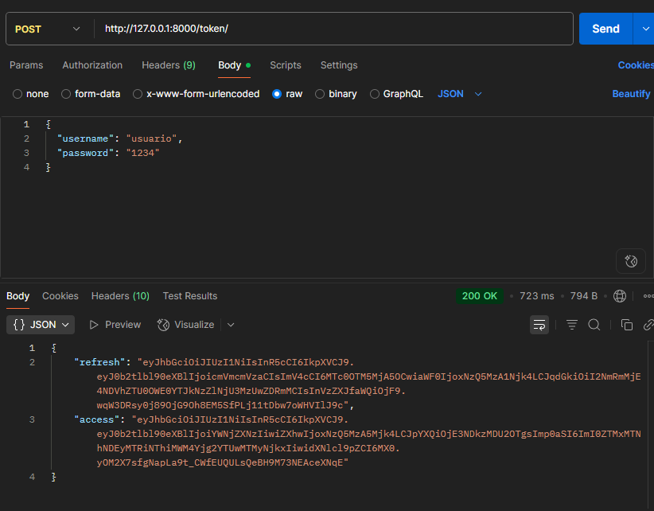
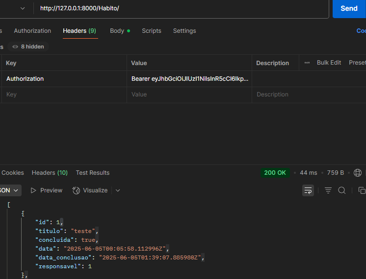
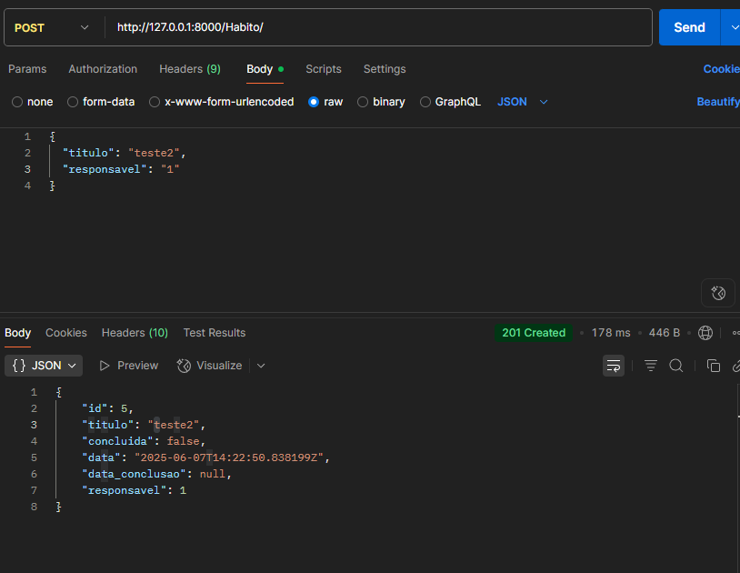
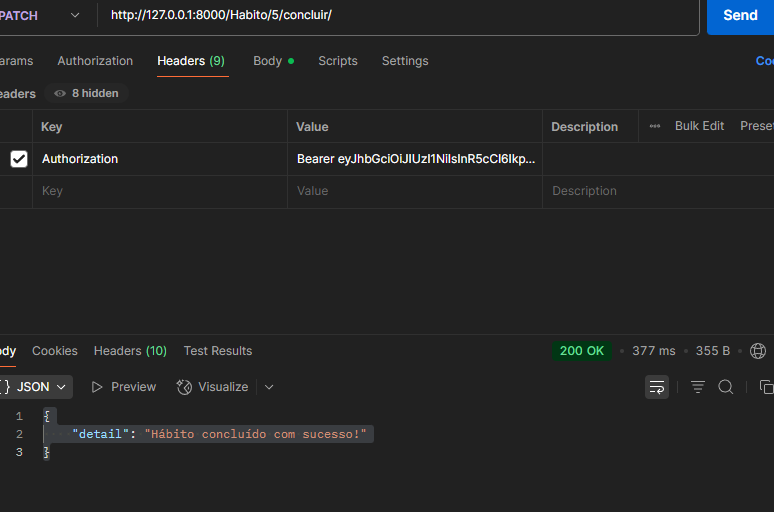
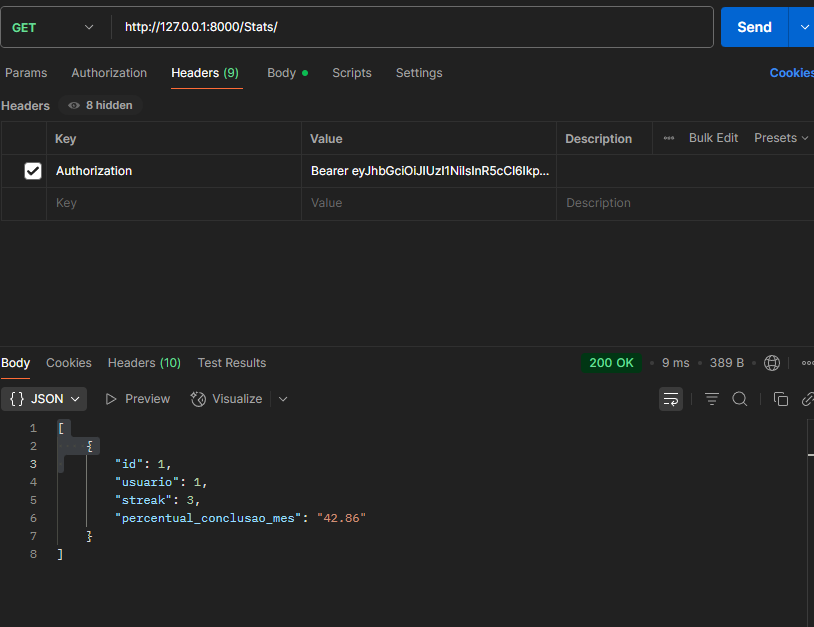

# 📊 Habit Tracker API

Uma API REST desenvolvida com Django e Django REST Framework para gerenciar hábitos diários. Permite o cadastro de hábitos, conclusão diária, e acompanha o progresso com streak e percentual de conclusão mensal — tudo vinculado ao usuário autenticado via JWT.

---

## ✅ Funcionalidades

- Cadastro e autenticação de usuários com **JWT**
- Criação, visualização e conclusão de hábitos
- Cada hábito é vinculado a um **usuário responsável**
- Apenas o usuário pode **concluir seu próprio hábito**
- Cálculo automático de:
  - `streak` (dias consecutivos de conclusão)
  - `% de conclusão no mês`
- Permissão de acesso restrita aos dados do próprio usuário


---

## 🚀 Tecnologias utilizadas

- Python 3.12
- Django 5.2
- Django REST Framework
- Simple JWT (autenticação)
- SQLite (banco de dados para testes)
- Postman (testes das requisições)

---

## 📸 Exemplos de uso

### 🔐 Autenticação com JWT

O usuário realiza login enviando `username` e `password` para o endpoint `/token/`. O servidor retorna os tokens `access` e `refresh`.



---

### 📋 Listagem de hábitos do usuário logado

Após autenticar, envie o token no header como `Bearer <token>` e consulte `/Habito/` para visualizar seus hábitos registrados.


Aqui podemos ver um exemplo de habito ja concluido
---
### ✅ Criar Hábito
Para criar um hábito, basta informar o **título** e o **responsável**.


### ✅ Concluir um hábito

Apenas o responsável pelo hábito pode concluí-lo, usando o método `PATCH` no endpoint `/Habito/<id>/concluir/`.



---

### 📋 Estatísticas de Hábitos
Usando o metodo `GET` no endpoint `/Stats/`
Acesse as estatísticas do usuário logado, como o streak (dias consecutivos com hábitos concluídos) e o percentual de conclusão no mês.
Esses dados são atualizados automaticamente conforme os hábitos são concluídos.
---
Exemplo -->



## ⚙️ Instalação e execução local

```bash
# Clone o repositório
git clone https://github.com/Drupin0-0/habit-tracker-api.git
cd habit-tracker-api

# Crie o ambiente virtual
python -m venv env
source env/bin/activate  # No Windows: env\Scripts\activate

# Instale as dependências
pip install -r requirements.txt

# Execute as migrações
python manage.py migrate

# Crie um superusuário (opcional para admin)
python manage.py createsuperuser

# Inicie o servidor
python manage.py runserver
